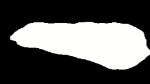
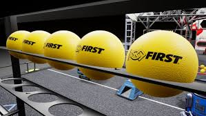
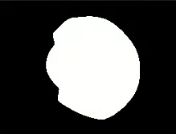
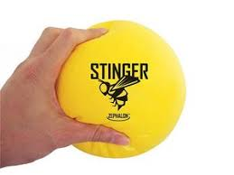
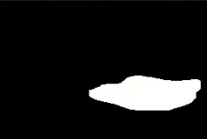
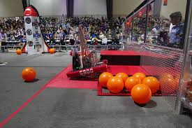
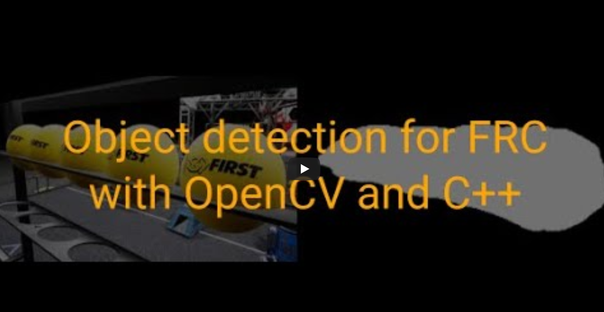

# Easy HSV-based Object Detection

This tool was developed for use on FRC. As 0rbianta, I will be competing with the Cosmos Robot Works(Team 7742) team in 2022 First Robotic Competition. In this study, I made a sample object detection project with color filtering. It's pretty easy. Maybe we can use deep learning-based object detection in the competition, who knows? If we choose this way, creating the dataset will be the hardest part of the work. Anyway. Enjoy the code. Feel free to contribute and test.

 

<h3> There is some example detections</h3>

  
   

  
   

  
   

# PoC available on YouTube

    MIT License

    Copyright (c) 2021 0rbianta

    Permission is hereby granted, free of charge, to any person obtaining a copy
    of this software and associated documentation files (the "Software"), to deal
    in the Software without restriction, including without limitation the rights
    to use, copy, modify, merge, publish, distribute, sublicense, and/or sell
    copies of the Software, and to permit persons to whom the Software is
    furnished to do so, subject to the following conditions:

    The above copyright notice and this permission notice shall be included in all
    copies or substantial portions of the Software.

    THE SOFTWARE IS PROVIDED "AS IS", WITHOUT WARRANTY OF ANY KIND, EXPRESS OR
    IMPLIED, INCLUDING BUT NOT LIMITED TO THE WARRANTIES OF MERCHANTABILITY,
    FITNESS FOR A PARTICULAR PURPOSE AND NONINFRINGEMENT. IN NO EVENT SHALL THE
    AUTHORS OR COPYRIGHT HOLDERS BE LIABLE FOR ANY CLAIM, DAMAGES OR OTHER
    LIABILITY, WHETHER IN AN ACTION OF CONTRACT, TORT OR OTHERWISE, ARISING FROM,
    OUT OF OR IN CONNECTION WITH THE SOFTWARE OR THE USE OR OTHER DEALINGS IN THE
    SOFTWARE.
